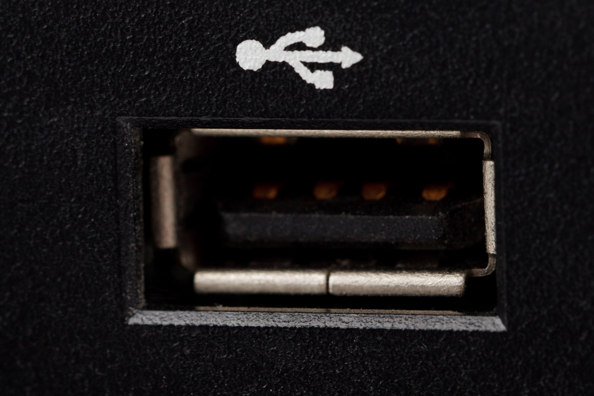
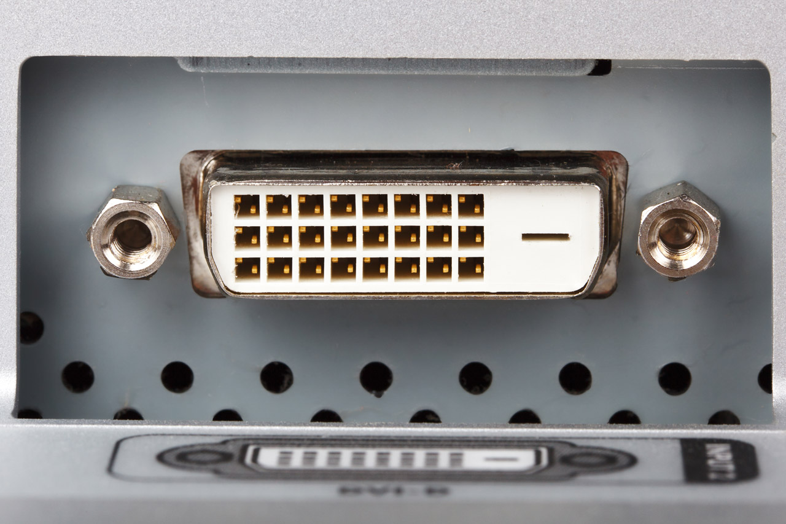
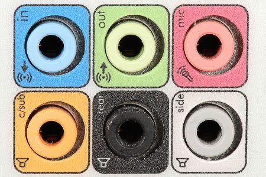
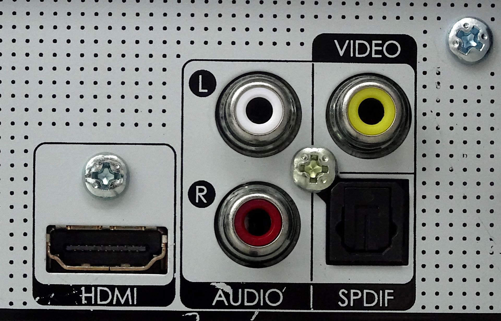

# Componentes internos    
---

Los componentes internos son aquellos que se encuentran dentro de la carcasa o caja del ordenador. Según el tipo de ordenador que consideremos unos componentes serán internos o externos. Por ejemplo: en un equipo de sobremesa el teclado será un elemento externo, mientras que en un portátil serán interno, aunque también tendríamos la posibilidad de añadir uno externo.

A lo largo de este documento tendremos como referencia un ordenador de sobremesa, salvo que se indique lo contrario en algún apartado específico.

## Placa base

Es una tarjeta electrónica, una placa de circuito impreso, a la que se conectan los distintos componentes tanto internos como externos que componen el ordenador. 

> [Evan-Amos, CC BY-SA 3.0](https://creativecommons.org/licenses/by-sa/3.0) via Wikimedia Commons

## Microprocesador

El microprocesador es el cerebro del ordenador

### Frecuencia del microprocesador

La frecuencia de trabajo de un microprocesador se mide en Hz, esto es, operaciones que realiza por segundo. Como un microprocesador realiza miles de millones de operaciones por segundo es necesario utilizar otras unidades como *kHz*, *MHz*, *GHz*. ¿Cuál es la relación entre ellas? 

*1kHz=1000Hz*

*1MHz= 1000kHz=1000000Hz*

*1GHz=1000MHz=1000000kHz=1000000000Hz*

!!!note "Observación"
    Si tienes dudas en el cambio de unidades, piensa en gramos y kilogramos o en metros y kilómetros. Seguro que así lo verás más claro.

¿Cuántas operaciones por segundo es capaz de realizar un microprocesador cuya frecuencia es 3,2GHz?

Para contestar a la pregunta hemos de realizar la siguiente operación

***3,2GHzx1000= 3200MHzx1000=3200000kHzx1000=3200000000 Hz =3,2x10^9Hz***.

Pero no todo es la frecuencia en un microprocesador, tenemos que tener en cuenta:

 - Número de núcleos del procesador (Dual Core, Quad Core, Octa Core).
 - Número de hilos (threads) del procesador.
 - Longitud de palabra (32 bist, 64 bits).

## Memoria RAM

La memoria RAM es una memoria a corto plazo, volátil (se pierde la información al desconectar la alimentación), de lectura y escritura (se puede escribir datos en ella y se pueden leer). RAM son las iniciales de *Random Access Memory*. Esto quiere decir que es posible acceder a cualquier posición de la memoria y que siempre va a tardar lo mismo en acceder a cualquier posición de la misma.

## Dispositivos de almacenamiento

Pueden utilizar diferentes tecnologías como:

 * Tecnología magnética: discos duros mecánicos (HDD)
 * Tecnología óptica: CD, DVD
 * Tecnología de estado sólido: memorias USB, SSD
 

# Componentes externos

---

Los componentes externos también llamados periféricos son aquellos que se conectan a la caja del ordenador para ampliar sus funcionalidades, por ejemplo un ratón, un teclado o un monitor entre otros. 

## Periféricos de entrada

Los periféricos de entrada son aquellos componentes externos que permiten introducir información en el ordenador, por lo tanto los datos entran al ordenador desde el periférico y por eso se llaman de entrada.

Ejemplos de periféricos de **entrada**:

* Teclado
* Ratón
* Micrófono
* Escáner

## Periféricos de salida

Los periféricos de salida son aquellos componentes externos que permiten sacar información del ordenador, los datos por tanto salen del ordenador para que los podamos ver, escuchar... y por eso se llaman de salida.

Ejemplos de periféricos de **salida**:

* Monitor
* Impresora
* Altavoces
* Auriculares

## Periféricos de entrada y salida

Los periféricos de entrada y salida son aquellos que realizan las dos operaciones, permiten introducir datos en el ordenador y sacar información del mismo. Por ejemplo una pizarra digital o una impresora multifunción.

## Otras clasificaciones

Se pueden establecer diferentes clasificaciones, en función de el sentido del flujo de datos como se ha visto anteriormente (entrada, salida o entrada/salida). Otra clasificación podría ser según la funcionalidad: almacenamiento, comunicación...

## Ejemplos

Son periféricos de entrada...

- [x] Ratón
- [ ]  Impresora
- [x] Cámara web
- [x] Joystick
- [x] Lector de código de barras
- [ ] Proyector

Puedes obtener más información en el tema 3 que encontrarás en [Aules](https://portal.edu.gva.es/aules/ "Plataforma educativa de la Comunitat Valenciana")

# Conectores y puertos

Los conectores internos también llamados slots o ranuras permiten ampliar la capacidades del ordenador, por ejemplo añadiendo una tarjeta de vídeo, de audio o de otros tipos para propósitos específicos.

## Conectores internos

- PCI
- PCI- Express
- SATA
- IDE
- ATX

## Puertos

Los puertos permiten conectar los componentes externos al ordenador. Existen muchos tipos de puertos, unos específicos como el de ***VGA*** para conectar un monitor, y otros más genéricos como el ***USB*** que permiten conectar desde un ratón o teclado a un disco duro externo o una cámara web.

|Nombre |Imagen|Señal| Periféricos|Características|
|:--|--|--|--|--:|
|**PS/2**||Datos| Ratón o Teclado|Obsoleto, ahora se utiliza USB|
|**USB**||Datos|Ratón, Teclado, Cámara web...|Existen diferentes estándares y tipos de conectores|
|**VGA**||Vídeo|Monitor|Asociado a monitores CRT, está siendo sustituido  por otros como ***DVI***, ***HDMI***|
|**DVI**||Vídeo analógico o digital|Monitores, |Tiene varias variantes, está siendo sustituido por ***HDMI***|
|**HDMI**||Audio y vídeo|Vídeoconsolas, televisores, proyectores, monitores|Está sustituyendo a conectores de vídeo anteriores como ***VGA*** y ***DVI***|
|**RJ45**||Comunicaciones|	Cable ethernet del Router, switch|Permite conectar un equipo a una red de comunicaciones|
|**Jack (3,5 mm)**||Audio|Auriculares, micrófono, altavoces...|Normalmente aparecen varios (de entrada, salida, subwoofers...), cada uno con un color|
|**S/PDIF (óptico)**||Audio digital|Reproductor de CD profesional, unidad de Minidisc|Existe una versión coaxial y otra *óptica*|
|**RS232** (Puerto serie)||Datos|Ratón, teclado. Equipos industriales|Obsoleto en los ordenadores[1]|
|**DB25** (Puerto paralelo)||Datos|Impresoras|Obsoleto[1]|
|...|...|...|...|...|

Puedes completar la tabla con más conectores que conozcas. Investiga en internet o consulta [Aules](https://portal.edu.gva.es/aules/ "Plataforma educativa de la Comunitat Valenciana").

!!!warning "Atención"
    [1] El conector USB ha reemplazado a estos conectores.

